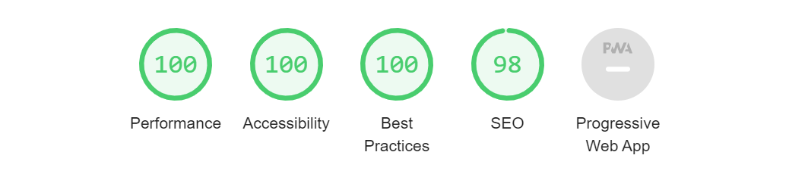

#### About

D3 curves playground.

#### Lighthouse report statistics:

#### Road map

    [ ] Editor
        [x] Store / retrieve state in localStorage
        [x] Select / deselect all checkeboxes at once
        [x] Add information about point locations
        [x] Add information about the current curve
            [x] Delay changing tooltips between lines
        [ ] TODO: Why SVG does not smooth on path control points on checkboxes?
        [ ] TODO: Find how to set fill on embedded SVG.
        [ ] BUG: In Chrome DevTools with dimentions responsive pointer events move points to negative coordinates.
        [x] When loading points, make sure the coordinates are inside SVG boundary.
        [ ] Controls poins
            [x] Allow drag points
            [x] Add / delete points
            [ ] Deduce drag events
            [x] Add point numbers
            [x] Add buttons +/- to modify number of points
            [x] Add disabled state for +/- buttons
            [x] Position buttons menu over SVG extra menu
            [ ] Add italic font for inactive buttons
            [ ] Define stroke and shadow colors
        [ ] TODO: Why jotai does not provide prev value access in update atom function?
        [ ] Add colors schema.

#### Links, references, credits

[D3 - Data-Driven Documents](https://github.com/d3/d3/wiki)
